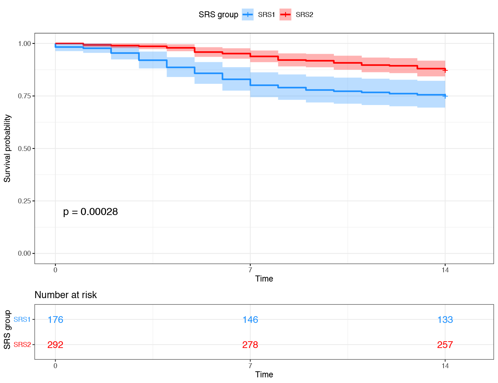
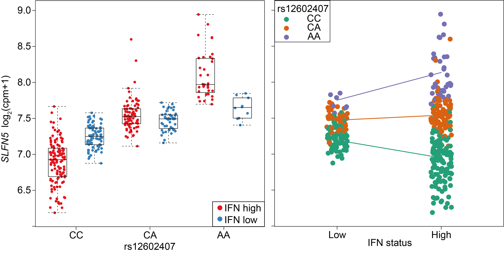

 
 
 
Our research aims to understand how genetics contributes to the variation between patients in their disease severity and response to treatments. Understanding this variation is vital for improving the success rate of clinical trials and providing a precision medicine approach for treating disease. Our strategy is to not only sequence a patient's DNA, but also to measure the activity of their genes through RNA-sequencing.  
 
We focus on diseases that involve systemic inflammation such as sepsis and systemic lupus erythematosus (SLE). For both of these diseases, patients present with variable clinical features making diagnosis and treatment challenging. We apply sophisticated analytical methods to analyse functional genomics data generated from cohorts of hundreds of patients and integrate this with clinical information.
 
 
## Patient stratification from transcriptomic profiling
 

  

    Sepsis is a life-threatening condition that occurs when the body's immune system damages it's own tissues and organs while trying to fight an infection. There is great individual variation in the way that people respond making sepsis a challenging disease to diagnose and treat. The underlying infection can be treated with antibiotics and failing organs can be supported but we still don't have treatments that tackle the immune response that is damaging the organs. We use transcriptomic profiling to stratify patients and further our understanding of the individual response to sepsis. We are exploring the transcriptomic response in patients presenting to the emergency room with suspected infection <a href="https://www.ucl.ac.uk/infection-immunity/research/research-department-infection/infection-clinical-research-hub/portfolio-studies/bioaid">(BioAID)</a> and in patients with sepsis admitted to the ICU <a href="https://ukccggains.com">(GAinS)</a>.
 
 
    Right: Patients with sepsis due to Community Acquired Pneumonia or Faecal Peritonitis were assigned to <a href="https://www.ncbi.nlm.nih.gov/pubmed/26917434">Sepsis Response Signature (SRS) endotype,</a> based on the expression of a small number of genes. The SRS1 endotype was associated with stronger features of T cell exhaustion, endotoxin tolerance and immunosuppression, and had a higher mortality rate (blue subgroup in Kaplan-Meier plot showing survival rate over the first 14 days in ICU).
  

  

    
  

 
 
## Role of regulatory DNA variants in patient heterogeneity
 

  

  
  A cohort of patients from a <a href="https://www.ncbi.nlm.nih.gov/pubmed/30340504">systemic lupus erythematosus clinical trial</a>.  An interaction between IFN status and the <em>SLFN5</em> eQTL is plotted.  
  Left: with respect to rs12602407 genotype.
  Right: with respect to IFN status of the sample.
  

  

  We integrate genetic information with our transcriptomic profiles to understand the role of genetics in the variation that we observe. We map expression quantitative trait locus (eQTL) in cohorts of patients and use eQTL interactions to understand how the environment can modulate these regulatory effects. We are interested in interactions both with disease severity and treatment with a drug.
   

  

 
 
## Drug target prioritisation from single-cell eQTL mapping
SLE is an autoimmune disease that can affect virtually any organ system in the body. This clinical heterogeneity has made the development of new drugs for treatment very challenging. To enable the development of new therapies, we are interested in better understanding the molecular mechanisms contributing to the disease pathophysiology. Through [Open Targets](https://www.opentargets.org), we are generating single-cell RNA-sequencing for a cohort of SLE patients. This will allow us to map eQTL at the single-cell level and gain mechanistic insights that can inform novel target identification for future drugs.
 
 
 
